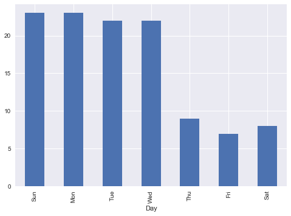

# Exploratory Data Analysis on SMRT Tweets

This demo will provide a brief introduction in performing a rudimentary analysis on train service disruptions in Singapore. Data scrapped are from the SMRT's twitter account and wikipedia containing the relevant train stations information such as name and code 

- scraping of data from website (twitter) using Selenium 
- scraping of tabular data from website (wikipedia) using Xpath
- exploratory data analysis (EDA) on the scrapped data
- data cleaning, data prepration and processing 
- geospatial analysis on frequency of service disruptions 

There are two primary methods of extracting data from the SMRT tweets (twitter website). The first method was to use the provided twitter API for getting SMRT tweets, while the second method was to scrap information out from the HTML codes on the official SMRT twitter website (https://twitter.com/smrt_singapore). Due to a limitation on the number of tweets the twitter's API could be pulled and an expected substantial number of SMRT tweets involved (approximately 4000 tweets), the latter method was employed to overcome twitter API's rate limitation 


## Extraction of SMRT Tweets using Selenium Web Driver

```python
import time
from selenium import webdriver
from bs4 import BeautifulSoup as bs

### Use either Firefox or Chrome to load the webpages
browser = webdriver.Firefox()
#browser = webdriver.Chrome()

### URL to scrap
url = "https://twitter.com/smrt_singapore?lang=en"

browser.get(url)
```


```python
### Selenium script to auto scroll to the end of page, with interval of 3 seconds between scroll.
### For purpose of testing, skip this part of code.

#from selenium import webdriver
#browser = webdriver.Firefox()
#browser.get("https://twitter.com/smrt_singapore?lang=en")
lenOfPage = browser.execute_script("window.scrollTo(0, document.body.scrollHeight); \
                                var lenOfPage=document.body.scrollHeight;return lenOfPage;")
match=False
while(match==False):
    lastCount = lenOfPage
    time.sleep(3)    # pause for 3 seconds before next scroll
    lenOfPage = browser.execute_script("window.scrollTo(0, document.body.scrollHeight);\
                                var lenOfPage=document.body.scrollHeight;return lenOfPage;")
    if lastCount==lenOfPage:
        match=True
```


```python
### Scrap the HTML after fully load the web page and load into BeautifulSoup.

source_data = browser.page_source
bs_data = bs(source_data, "lxml")
```


```python
### Verify data extraction for one tweet is correct.

article_info = bs_data.find("p", {"class": 'TweetTextSize TweetTextSize--normal js-tweet-text tweet-text'})
print(article_info.text)

article_info = bs_data.find('a', {'class': 'tweet-timestamp js-permalink js-nav js-tooltip' })['title']
print (article_info)
```

    All 35 EWL stns from Tuas Link to Pasir Ris & from Tanah Merah to Changi Airport will have shorter operational hrs every weekend from 6 to 29 April. Shuttle bus svcs will be available between the stns. Plan ahead & take other train lines and bus svcs. https://bit.ly/2Gvq1Br pic.twitter.com/u47bY0op8M
    2:38 AM - 2 Apr 2018


```python
### Verify REGEX pattern extracts correctly

import re

# Sample tweet
s = '[NSL] CLEARED: Train svc from #YewTee to #JurongEast is running normally now.'

repatt = r'[\bbetween\b|\bbtwn\b|\bfrom\b] \#(\w*)[\s\w]*[and|to|&]*[\s]*\#[\s]*(\w*)'
#repatt = r"\bCLEARED\b|\bcleared\b|\bCleared\b|\bhave resume\b|\bhave resumed\b|\bhas resumed\b|\bservice resumed\b|\bnormal\b|\bnormally\b|\bceased\b|\bcease\b"    # indication that fault is cleared or services is resumed
#repatt = r'\bEWL\b|\bNSL\b|\bCCL\b'
#repatt  = r'[F|f][ree][\w\s\d\&\#]*end'

extract = re.search(repatt, s)
if extract:  
    print ("From: %s  To: %s\n" % (extract.group(1), extract.group(2)))
    #print (extract.group(0))
else:
    print("Extraction Error")
```

    From: YewTee  To: JurongEast


```python
### Actual script to extract all the relevant data (tweets, date/time, Station Names, MRT Status)

from datetime import datetime
import re

article_infoAll = bs_data.find_all("div", {"class": 'content'})

smrt_tweet_data = []  # list container to hold all extracted SMRT tweet

### Regex extraction pattern
### ========================
re_mrtline = r'^[\[]*(\bNSL\b|\bEWL\b|\bCCL\b|\bBPLRT\b|\bDTL\b)'
re_mrtstatus = r'\bCLEARED\b|\bcleared\b|\bCleared\b|\bhave resume\b|\bhave resumed\b|\bhas resumed\b|\bservice resumed\b|\bnormal\b|\bnormally\b|\bceased\b|\bcease\b'    # indication that fault is cleared or services is resumed
re_patt = r'[F|f][ree][\w\s\d\&\#]*ended'
re_stn = r'[\bbetween\b|\bbtwn\b|\bfrom\b] \#(\w*)[\s\w]*[and|to|&]*[\s]*\#[\s]*(\w*)'

for item in article_infoAll:

    tweet_row = [] # list container to hold extracted tweet info for each SMRT tweet

    try:

        ### Extract tweet body from html
        ### ============================
        tweet_body = item.find("p", {"class": 'TweetTextSize TweetTextSize--normal js-tweet-text tweet-text'})
        tweet_row.append(tweet_body.text)

        ### Extract date and time from the html
        ### ===================================
        tweet_datetime = item.find('a', {'class': 'tweet-timestamp js-permalink js-nav js-tooltip' })['title']
        tweet_row.append(tweet_datetime)

        ### Convert extract tweet_datetime into datetime object so that it can be calculated
        ### =======================================
        date = datetime.strptime(tweet_datetime, '%I:%M %p - %d %b %Y')
        print("Converted date/time: %s" % date)
        tweet_row.append(date)        

        ### ================================================================================
        ### If tweet starts with [xxx], it indicate the tweet had MRT status information
        ### Extract tweet using regex to determine status type, i.e.'cleared', 'update', 'ok'
        ### ================================================================================

        ### Extract and check if tweet starts with [xxx]
        ### ============================================
        mrtline = re.search(re_mrtline, tweet_body.text)

        if mrtline:  # if the tweet starts with [XXX], then it is a status tweet
            ### Extract MRT Line inside []
            ### ==========================
            print("Extracted MRT Line: " + mrtline.group(1))
            tweet_row.append(mrtline.group(1))

            ### Extract MRT Line status based on keywords
            ### =========================================
            mrtstatus = re.search(re_mrtstatus, tweet_body.text)
            if mrtstatus:   # if is status is stated 'cleared' in tweeter
                print("Status: Cleared")
                print("Extracted tweet: %s\n" % tweet_body.text)
                tweet_row.append('cleared')
            else:
                patt=re.search(re_patt, tweet_body.text)
                if patt:    # check if there are other indicators that inferred as 'cleared'. Such as 'Free ... ended'.
                    print("Status: Cleared")
                    print("Extracted tweet: %s\n" % tweet_body.text)
                    tweet_row.append('cleared')
                else:       # if is a status tweet but no 'cleared' status, then the tweet will be a disruption status.
                    print("Status: Update")
                    print("Extracted tweet: %s" % tweet_body.text.replace('\n','')) # some tweet has newline
                    tweet_row.append('update')

                    ### Extract station names
                    ### =====================
                    stn = re.search(re_stn, tweet_body.text)
                    if extract:
                        print ("From: %s  To: %s\n" % (stn.group(1), stn.group(2)))  
                        tweet_row.append(stn.group(1))   # from station
                        tweet_row.append(stn.group(2))   # to station

        else:    # if no mrt line mention in [xxx] format, then it is a normal information tweets.
            tweet_row.append('None')
            tweet_row.append('ok')
            print('Status: OK')
            print('Extracted tweet: %s\n' % tweet_body.text)   # for checking only

        ### Store the extracted tweet info into the list container
        smrt_tweet_data.append(tweet_row)

    except:
        print("Extraction Error!\n")
        continue
```

    Converted date/time: 2018-04-02 02:38:00
    Status: OK
    Extracted tweet: All 35 EWL stns from Tuas Link to Pasir Ris & from Tanah Merah to Changi Airport will have shorter operational hrs every weekend from 6 to 29 April. Shuttle bus svcs will be available between the stns. Plan ahead & take other train lines and bus svcs. https://bit.ly/2Gvq1Br pic.twitter.com/u47bY0op8M

    Converted date/time: 2018-03-08 00:53:00
    Status: OK
    Extracted tweet: Gentle reminder that svc improvement has been made to shuttle bus svc 6 for better connectivity. Shuttle bus svc 6 will now be extended to ply from Raffles Place to Paya Lebar stns (both bounds). http://bit.ly/2oyza4d pic.twitter.com/22CPlP1JYR

    Converted date/time: 2018-03-08 00:44:00
    Status: OK
    Extracted tweet: All EWL stns from Tuas Link to Pasir Ris & from Tanah Merah to Changi Airport will have shorter operational hrs every weekend & selected weekdays from 2 Mar to 1 Apr.Shuttle bus svcs will be avail btwn the stns.Plan ahead & take other train lines/bus svcs. http://bit.ly/2FyKFkd pic.twitter.com/qj7qMVo9LJ

    Converted date/time: 2018-03-03 20:02:00
    Status: OK
    Extracted tweet: Here’s a sneak peek of our SMRT’s new uniforms, fresh from the oven! It’s been nine years since the last transformation and our staff are excited to serve you with this fresh look starting tomorrow! Look out for them at all our MRT stations and say hi!pic.twitter.com/FDi5WbZnLL


```python
### Tabulate all the extracted data into table using panda
import pandas as pd

df = pd.DataFrame(smrt_tweet_data, columns=['Tweet', 'Extracted Date/Time', 'Date/Time', 'MRT_Line', 'Status', 'From_Stn', 'To_Stn'])

df.head(10)
```


<div>

<table border="1" class="dataframe">
  <thead>
    <tr style="text-align: right;">
      <th></th>
      <th>Tweet</th>
      <th>Extracted Date/Time</th>
      <th>Date/Time</th>
      <th>MRT_Line</th>
      <th>Status</th>
      <th>From_Stn</th>
      <th>To_Stn</th>
    </tr>
  </thead>
  <tbody>
    <tr>
      <th>0</th>
      <td>All 35 EWL stns from Tuas Link to Pasir Ris &amp; ...</td>
      <td>2:38 AM - 2 Apr 2018</td>
      <td>2018-04-02 02:38:00</td>
      <td>None</td>
      <td>ok</td>
      <td>None</td>
      <td>None</td>
    </tr>
    <tr>
      <th>1</th>
      <td>Gentle reminder that svc improvement has been ...</td>
      <td>12:53 AM - 8 Mar 2018</td>
      <td>2018-03-08 00:53:00</td>
      <td>None</td>
      <td>ok</td>
      <td>None</td>
      <td>None</td>
    </tr>
    <tr>
      <th>2</th>
      <td>All EWL stns from Tuas Link to Pasir Ris &amp; fro...</td>
      <td>12:44 AM - 8 Mar 2018</td>
      <td>2018-03-08 00:44:00</td>
      <td>None</td>
      <td>ok</td>
      <td>None</td>
      <td>None</td>
    </tr>
    <tr>
      <th>3</th>
      <td>Here’s a sneak peek of our SMRT’s new uniforms...</td>
      <td>8:02 PM - 3 Mar 2018</td>
      <td>2018-03-03 20:02:00</td>
      <td>None</td>
      <td>ok</td>
      <td>None</td>
      <td>None</td>
    </tr>
    <tr>
      <th>4</th>
      <td>All EWL stns from Tuas Link to Pasir Ris &amp; fro...</td>
      <td>3:19 AM - 1 Mar 2018</td>
      <td>2018-03-01 03:19:00</td>
      <td>None</td>
      <td>ok</td>
      <td>None</td>
      <td>None</td>
    </tr>
    <tr>
      <th>5</th>
      <td>Track improvement works in the North-South Lin...</td>
      <td>3:26 AM - 19 Feb 2018</td>
      <td>2018-02-19 03:26:00</td>
      <td>None</td>
      <td>ok</td>
      <td>None</td>
      <td>None</td>
    </tr>
    <tr>
      <th>6</th>
      <td>[NSL] CLEARED: Train svcs from #AngMoKio to #R...</td>
      <td>6:17 PM - 18 Feb 2018</td>
      <td>2018-02-18 18:17:00</td>
      <td>NSL</td>
      <td>cleared</td>
      <td>None</td>
      <td>None</td>
    </tr>
    <tr>
      <th>7</th>
      <td>[NSL] UPDATE: Due to on going track improvemen...</td>
      <td>6:01 PM - 18 Feb 2018</td>
      <td>2018-02-18 18:01:00</td>
      <td>NSL</td>
      <td>update</td>
      <td>AngMoKio</td>
      <td>RafflesPlace</td>
    </tr>
    <tr>
      <th>8</th>
      <td>[NSL] : Due to on going track improvement work...</td>
      <td>4:29 PM - 18 Feb 2018</td>
      <td>2018-02-18 16:29:00</td>
      <td>NSL</td>
      <td>update</td>
      <td>AngMoKio</td>
      <td>RafflesPlace</td>
    </tr>
    <tr>
      <th>9</th>
      <td>Wishing everyone a Happy and Prosperous Lunar ...</td>
      <td>8:01 AM - 15 Feb 2018</td>
      <td>2018-02-15 08:01:00</td>
      <td>None</td>
      <td>ok</td>
      <td>None</td>
      <td>None</td>
    </tr>
  </tbody>
</table>
</div>


```python
### Number of SMRT tweets extracted
df.shape
```


    (710, 7)


```python
### Save all extracted tweets into csv
df.to_csv("smrt_tweet_extract.csv")
```


```python
### Clean up the data
### Remove 'ok' status to focus on tweet with status

df = df[df.Status != 'ok']

df.head(10)   
```


<div>

<table border="1" class="dataframe">
  <thead>
    <tr style="text-align: right;">
      <th></th>
      <th>Tweet</th>
      <th>Extracted Date/Time</th>
      <th>Date/Time</th>
      <th>MRT_Line</th>
      <th>Status</th>
      <th>From_Stn</th>
      <th>To_Stn</th>
    </tr>
  </thead>
  <tbody>
    <tr>
      <th>6</th>
      <td>[NSL] CLEARED: Train svcs from #AngMoKio to #R...</td>
      <td>6:17 PM - 18 Feb 2018</td>
      <td>2018-02-18 18:17:00</td>
      <td>NSL</td>
      <td>cleared</td>
      <td>None</td>
      <td>None</td>
    </tr>
    <tr>
      <th>7</th>
      <td>[NSL] UPDATE: Due to on going track improvemen...</td>
      <td>6:01 PM - 18 Feb 2018</td>
      <td>2018-02-18 18:01:00</td>
      <td>NSL</td>
      <td>update</td>
      <td>AngMoKio</td>
      <td>RafflesPlace</td>
    </tr>
    <tr>
      <th>8</th>
      <td>[NSL] : Due to on going track improvement work...</td>
      <td>4:29 PM - 18 Feb 2018</td>
      <td>2018-02-18 16:29:00</td>
      <td>NSL</td>
      <td>update</td>
      <td>AngMoKio</td>
      <td>RafflesPlace</td>
    </tr>
    <tr>
      <th>10</th>
      <td>[NSL] CLEARED: Train svcs from #AngMoKio to #R...</td>
      <td>6:07 PM - 13 Feb 2018</td>
      <td>2018-02-13 18:07:00</td>
      <td>NSL</td>
      <td>cleared</td>
      <td>None</td>
      <td>None</td>
    </tr>
    <tr>
      <th>11</th>
      <td>[NSL Update]: Due to maintenance work, trains ...</td>
      <td>5:04 PM - 13 Feb 2018</td>
      <td>2018-02-13 17:04:00</td>
      <td>NSL</td>
      <td>update</td>
      <td>AngMoKio</td>
      <td>Raffles</td>
    </tr>
    <tr>
      <th>12</th>
      <td>[NSL]: Due to maintenance work, south-bound tr...</td>
      <td>1:45 PM - 13 Feb 2018</td>
      <td>2018-02-13 13:45:00</td>
      <td>NSL</td>
      <td>update</td>
      <td>AngMoKio</td>
      <td>RafflesPlace</td>
    </tr>
    <tr>
      <th>13</th>
      <td>[NSL] UPDATE: Fault cleared, train svcs from #...</td>
      <td>6:38 PM - 6 Feb 2018</td>
      <td>2018-02-06 18:38:00</td>
      <td>NSL</td>
      <td>cleared</td>
      <td>None</td>
      <td>None</td>
    </tr>
    <tr>
      <th>14</th>
      <td>[NSL] UPDATE: Due to on going track improvemen...</td>
      <td>6:04 PM - 6 Feb 2018</td>
      <td>2018-02-06 18:04:00</td>
      <td>NSL</td>
      <td>update</td>
      <td>AngMoKio</td>
      <td>RafflesPlace</td>
    </tr>
    <tr>
      <th>15</th>
      <td>[NSL] UPDATE: Fault cleared, train svcs are pr...</td>
      <td>5:18 PM - 6 Feb 2018</td>
      <td>2018-02-06 17:18:00</td>
      <td>NSL</td>
      <td>cleared</td>
      <td>None</td>
      <td>None</td>
    </tr>
    <tr>
      <th>16</th>
      <td>[NSL] UPDATE: Fault cleared, train svcs are pr...</td>
      <td>4:46 PM - 6 Feb 2018</td>
      <td>2018-02-06 16:46:00</td>
      <td>NSL</td>
      <td>cleared</td>
      <td>None</td>
      <td>None</td>
    </tr>
  </tbody>
</table>
</div>


```python
### Number of tweets with MRT Line status update
df.shape
```


    (583, 7)


```python
### Sort dataframe according to MRT line (ascending) and Date/time (descending)
### This will help in the calculation of disruption duration
df.sort_values(['MRT_Line', 'Date/Time'], ascending=[True, False], inplace=True)

df.head(10)  
```


<div>

<table border="1" class="dataframe">
  <thead>
    <tr style="text-align: right;">
      <th></th>
      <th>Tweet</th>
      <th>Extracted Date/Time</th>
      <th>Date/Time</th>
      <th>MRT_Line</th>
      <th>Status</th>
      <th>From_Stn</th>
      <th>To_Stn</th>
    </tr>
  </thead>
  <tbody>
    <tr>
      <th>20</th>
      <td>[BPLRT] Fault cleared. Normal train services a...</td>
      <td>12:54 AM - 18 Jan 2018</td>
      <td>2018-01-18 00:54:00</td>
      <td>BPLRT</td>
      <td>cleared</td>
      <td>None</td>
      <td>None</td>
    </tr>
    <tr>
      <th>21</th>
      <td>[BPLRT]: No train service between #ChoaChuKang...</td>
      <td>12:12 AM - 18 Jan 2018</td>
      <td>2018-01-18 00:12:00</td>
      <td>BPLRT</td>
      <td>update</td>
      <td>ChoaChuKang</td>
      <td>Phoenix</td>
    </tr>
    <tr>
      <th>22</th>
      <td>[BPLRT] CLEARED: Free regular and bridging bus...</td>
      <td>3:09 AM - 12 Jan 2018</td>
      <td>2018-01-12 03:09:00</td>
      <td>BPLRT</td>
      <td>cleared</td>
      <td>None</td>
      <td>None</td>
    </tr>
    <tr>
      <th>23</th>
      <td>[BPLRT] UPDATE: Train services on the entire B...</td>
      <td>2:30 AM - 12 Jan 2018</td>
      <td>2018-01-12 02:30:00</td>
      <td>BPLRT</td>
      <td>cleared</td>
      <td>None</td>
      <td>None</td>
    </tr>
    <tr>
      <th>24</th>
      <td>[BPLRT] UPDATE: Service B on the BPLRT inner l...</td>
      <td>2:04 AM - 12 Jan 2018</td>
      <td>2018-01-12 02:04:00</td>
      <td>BPLRT</td>
      <td>cleared</td>
      <td>None</td>
      <td>None</td>
    </tr>
    <tr>
      <th>165</th>
      <td>[BPLRT] CLEARED: Free bus and bridging bus ser...</td>
      <td>1:45 AM - 9 Sep 2017</td>
      <td>2017-09-09 01:45:00</td>
      <td>BPLRT</td>
      <td>cleared</td>
      <td>None</td>
      <td>None</td>
    </tr>
    <tr>
      <th>166</th>
      <td>[BPLRT] CLEARED: Normal service on the BPLRT h...</td>
      <td>1:25 AM - 9 Sep 2017</td>
      <td>2017-09-09 01:25:00</td>
      <td>BPLRT</td>
      <td>cleared</td>
      <td>None</td>
      <td>None</td>
    </tr>
    <tr>
      <th>203</th>
      <td>[BPLRT]\nCLEARED: Train services on the Servic...</td>
      <td>11:56 PM - 11 Aug 2017</td>
      <td>2017-08-11 23:56:00</td>
      <td>BPLRT</td>
      <td>cleared</td>
      <td>None</td>
      <td>None</td>
    </tr>
    <tr>
      <th>205</th>
      <td>[BPLRT]\nCLEARED: Train services on the Servic...</td>
      <td>2:15 AM - 27 Jul 2017</td>
      <td>2017-07-27 02:15:00</td>
      <td>BPLRT</td>
      <td>cleared</td>
      <td>None</td>
      <td>None</td>
    </tr>
    <tr>
      <th>206</th>
      <td>[BPLRT]\nUPDATE: Train fault between #Senja an...</td>
      <td>2:05 AM - 27 Jul 2017</td>
      <td>2017-07-27 02:05:00</td>
      <td>BPLRT</td>
      <td>update</td>
      <td>Senja</td>
      <td>Jelapang</td>
    </tr>
  </tbody>
</table>
</div>


```python
### Re-index the dataframe to prepare to calculate disruption duration
df = df.reset_index(drop=True)
df.head(10)
```


<div>

<table border="1" class="dataframe">
  <thead>
    <tr style="text-align: right;">
      <th></th>
      <th>Tweet</th>
      <th>Extracted Date/Time</th>
      <th>Date/Time</th>
      <th>MRT_Line</th>
      <th>Status</th>
      <th>From_Stn</th>
      <th>To_Stn</th>
    </tr>
  </thead>
  <tbody>
    <tr>
      <th>0</th>
      <td>[BPLRT] Fault cleared. Normal train services a...</td>
      <td>12:54 AM - 18 Jan 2018</td>
      <td>2018-01-18 00:54:00</td>
      <td>BPLRT</td>
      <td>cleared</td>
      <td>None</td>
      <td>None</td>
    </tr>
    <tr>
      <th>1</th>
      <td>[BPLRT]: No train service between #ChoaChuKang...</td>
      <td>12:12 AM - 18 Jan 2018</td>
      <td>2018-01-18 00:12:00</td>
      <td>BPLRT</td>
      <td>update</td>
      <td>ChoaChuKang</td>
      <td>Phoenix</td>
    </tr>
    <tr>
      <th>2</th>
      <td>[BPLRT] CLEARED: Free regular and bridging bus...</td>
      <td>3:09 AM - 12 Jan 2018</td>
      <td>2018-01-12 03:09:00</td>
      <td>BPLRT</td>
      <td>cleared</td>
      <td>None</td>
      <td>None</td>
    </tr>
    <tr>
      <th>3</th>
      <td>[BPLRT] UPDATE: Train services on the entire B...</td>
      <td>2:30 AM - 12 Jan 2018</td>
      <td>2018-01-12 02:30:00</td>
      <td>BPLRT</td>
      <td>cleared</td>
      <td>None</td>
      <td>None</td>
    </tr>
    <tr>
      <th>4</th>
      <td>[BPLRT] UPDATE: Service B on the BPLRT inner l...</td>
      <td>2:04 AM - 12 Jan 2018</td>
      <td>2018-01-12 02:04:00</td>
      <td>BPLRT</td>
      <td>cleared</td>
      <td>None</td>
      <td>None</td>
    </tr>
    <tr>
      <th>5</th>
      <td>[BPLRT] CLEARED: Free bus and bridging bus ser...</td>
      <td>1:45 AM - 9 Sep 2017</td>
      <td>2017-09-09 01:45:00</td>
      <td>BPLRT</td>
      <td>cleared</td>
      <td>None</td>
      <td>None</td>
    </tr>
    <tr>
      <th>6</th>
      <td>[BPLRT] CLEARED: Normal service on the BPLRT h...</td>
      <td>1:25 AM - 9 Sep 2017</td>
      <td>2017-09-09 01:25:00</td>
      <td>BPLRT</td>
      <td>cleared</td>
      <td>None</td>
      <td>None</td>
    </tr>
    <tr>
      <th>7</th>
      <td>[BPLRT]\nCLEARED: Train services on the Servic...</td>
      <td>11:56 PM - 11 Aug 2017</td>
      <td>2017-08-11 23:56:00</td>
      <td>BPLRT</td>
      <td>cleared</td>
      <td>None</td>
      <td>None</td>
    </tr>
    <tr>
      <th>8</th>
      <td>[BPLRT]\nCLEARED: Train services on the Servic...</td>
      <td>2:15 AM - 27 Jul 2017</td>
      <td>2017-07-27 02:15:00</td>
      <td>BPLRT</td>
      <td>cleared</td>
      <td>None</td>
      <td>None</td>
    </tr>
    <tr>
      <th>9</th>
      <td>[BPLRT]\nUPDATE: Train fault between #Senja an...</td>
      <td>2:05 AM - 27 Jul 2017</td>
      <td>2017-07-27 02:05:00</td>
      <td>BPLRT</td>
      <td>update</td>
      <td>Senja</td>
      <td>Jelapang</td>
    </tr>
  </tbody>
</table>
</div>


```python
### Calculate the disruption duration and convert into minutes.
### Taking the [Clear time] - [1st Fault Reported]
### Extract the affected train stations and placed it together with the disruption duration

cleared_found=False
curr_status=''
last_datetime=''
curr_datetime=''
cleared_datetime=''
curr_mrtlinr=''

curr_fromstn=''
curr_tostn=''
last_fromstn=''
last_tostn=''

dur_list = []
to_list=[]
fr_list=[]

for index in range(len(df)):
    curr_status = df.Status[index]
    curr_datetime = df['Date/Time'][index]

    curr_fromstn = df['From_Stn'][index]
    curr_tostn = df['To_Stn'][index]

    if index == 0:
        curr_mrtline = df.MRT_Line[index]
        last_mrtline = df.MRT_Line[index]
    else:
        curr_mrtline = df.MRT_Line[index]

    dur_list.append('0')  # default duration = 0 minutes

    to_list.append('None')
    fr_list.append('None')

    if curr_status=='cleared' and cleared_found==False:
        cleared_datetime = curr_datetime
        cleared_index = index              # remember the index so that the fault duration can be updated
        cleared_found = True

    elif cleared_found==True and (curr_status=='cleared' or curr_status=='ok'):
        #datetime_diff = cleared_datetime - last_datetime    # calculate the time difference
        datetime_diff = (cleared_datetime - last_datetime).total_seconds()/60    # calculate the time difference and convert into minutes
        print("List index position          : %s" % cleared_index)
        print("Disruption Cleared Time      : %s" % cleared_datetime)
        print("1st Disruption Reported Time : %s" % last_datetime)
        print("Disruption Duration (minutes): %s" % datetime_diff)
        print("From Station                 : %s" % last_fromstn)
        print("To Station                   : %s\n" % last_tostn)

        dur_list[cleared_index]=datetime_diff     # store the fault duration time in the list
        fr_list[cleared_index]=last_fromstn       # store the from station in the list
        to_list[cleared_index]=last_tostn         # store the to station in the list

        cleared_found=False        

        if curr_status=='cleared':
            cleared_datetime = curr_datetime
            cleared_index = index
            cleared_found = True

    last_datetime = curr_datetime
    last_mrtline = curr_mrtline

    last_fromstn = curr_fromstn
    last_tostn = curr_tostn

```

    List index position          : 0
    Disruption Cleared Time      : 2018-01-18 00:54:00
    1st Disruption Reported Time : 2018-01-18 00:12:00
    Disruption Duration (minutes): 42.0
    From Station                 : ChoaChuKang
    To Station                   : Phoenix

    List index position          : 2
    Disruption Cleared Time      : 2018-01-12 03:09:00
    1st Disruption Reported Time : 2018-01-12 03:09:00
    Disruption Duration (minutes): 0.0
    From Station                 : None
    To Station                   : None

    List index position          : 3
    Disruption Cleared Time      : 2018-01-12 02:30:00
    1st Disruption Reported Time : 2018-01-12 02:30:00
    Disruption Duration (minutes): 0.0
    From Station                 : None
    To Station                   : None

    List index position          : 4
    Disruption Cleared Time      : 2018-01-12 02:04:00
    1st Disruption Reported Time : 2018-01-12 02:04:00
    Disruption Duration (minutes): 0.0
    From Station                 : None
    To Station                   : None

    List index position          : 5
    Disruption Cleared Time      : 2017-09-09 01:45:00
    1st Disruption Reported Time : 2017-09-09 01:45:00
    Disruption Duration (minutes): 0.0
    From Station                 : None
    To Station                   : None

    List index position          : 6
    Disruption Cleared Time      : 2017-09-09 01:25:00
    1st Disruption Reported Time : 2017-09-09 01:25:00
    Disruption Duration (minutes): 0.0
    From Station                 : None
    To Station                   : None

    List index position          : 7
    Disruption Cleared Time      : 2017-08-11 23:56:00
    1st Disruption Reported Time : 2017-08-11 23:56:00
    Disruption Duration (minutes): 0.0
    From Station                 : None
    To Station                   : None

    List index position          : 8
    Disruption Cleared Time      : 2017-07-27 02:15:00
    1st Disruption Reported Time : 2017-07-27 02:05:00
    Disruption Duration (minutes): 10.0
    From Station                 : Senja
    To Station                   : Jelapang

    List index position          : 10
    Disruption Cleared Time      : 2017-07-19 23:03:00
    1st Disruption Reported Time : 2017-07-19 23:03:00
    Disruption Duration (minutes): 0.0
    From Station                 : None
    To Station                   : None

    List index position          : 11
    Disruption Cleared Time      : 2017-07-19 22:58:00
    1st Disruption Reported Time : 2017-07-19 22:45:00
    Disruption Duration (minutes): 13.0
    From Station                 : ChoaChuKang
    To Station                   : BukitPanjang

    List index position          : 13
    Disruption Cleared Time      : 2017-03-28 07:02:00
    1st Disruption Reported Time : 2017-03-28 07:02:00
    Disruption Duration (minutes): 0.0
    From Station                 : None
    To Station                   : None

    List index position          : 14
    Disruption Cleared Time      : 2017-03-28 06:28:00
    1st Disruption Reported Time : 2017-03-28 06:28:00
    Disruption Duration (minutes): 0.0
    From Station                 : None
    To Station                   : None

    List index position          : 15
    Disruption Cleared Time      : 2017-02-10 00:12:00
    1st Disruption Reported Time : 2017-02-10 00:12:00
    Disruption Duration (minutes): 0.0
    From Station                 : None
    To Station                   : None

    List index position          : 16
    Disruption Cleared Time      : 2017-02-09 23:43:00
    1st Disruption Reported Time : 2017-02-09 23:43:00
    Disruption Duration (minutes): 0.0
    From Station                 : None
    To Station                   : None

    List index position          : 17
    Disruption Cleared Time      : 2016-10-26 04:37:00
    1st Disruption Reported Time : 2016-10-26 04:37:00
    Disruption Duration (minutes): 0.0
    From Station                 : None
    To Station                   : None

    List index position          : 18
    Disruption Cleared Time      : 2016-10-26 04:32:00
    1st Disruption Reported Time : 2016-10-26 04:32:00
    Disruption Duration (minutes): 0.0
    From Station                 : None
    To Station                   : None

    List index position          : 19
    Disruption Cleared Time      : 2016-10-26 04:12:00
    1st Disruption Reported Time : 2016-10-26 02:51:00
    Disruption Duration (minutes): 81.0
    From Station                 : BukitPanjang
    To Station                   : Phoenix

    List index position          : 21
    Disruption Cleared Time      : 2016-09-28 14:20:00
    1st Disruption Reported Time : 2016-09-28 14:20:00
    Disruption Duration (minutes): 0.0
    From Station                 : None
    To Station                   : None

    List index position          : 22
    Disruption Cleared Time      : 2016-09-28 00:36:00
    1st Disruption Reported Time : 2016-09-28 00:36:00
    Disruption Duration (minutes): 0.0
    From Station                 : None
    To Station                   : None

    List index position          : 23
    Disruption Cleared Time      : 2016-09-27 22:53:00
    1st Disruption Reported Time : 2016-09-27 19:56:00
    Disruption Duration (minutes): 177.0
    From Station                 : ChoaChuKang
    To Station                   : BukitPanjang

    List index position          : 26
    Disruption Cleared Time      : 2016-09-27 18:52:00
    1st Disruption Reported Time : 2016-09-27 18:52:00
    Disruption Duration (minutes): 0.0
    From Station                 : None
    To Station                   : None

    List index position          : 27
    Disruption Cleared Time      : 2016-09-27 09:42:00
    1st Disruption Reported Time : 2016-09-27 09:42:00
    Disruption Duration (minutes): 0.0
    From Station                 : None
    To Station                   : None

    List index position          : 28
    Disruption Cleared Time      : 2016-09-27 09:27:00
    1st Disruption Reported Time : 2016-09-27 07:55:00
    Disruption Duration (minutes): 92.0
    From Station                 : ChoaChuKang
    To Station                   : BukitPanjang

    List index position          : 30
    Disruption Cleared Time      : 2016-04-25 07:16:00
    1st Disruption Reported Time : 2016-04-25 07:16:00
    Disruption Duration (minutes): 0.0
    From Station                 : None
    To Station                   : None

    List index position          : 31
    Disruption Cleared Time      : 2016-04-25 07:12:00
    1st Disruption Reported Time : 2016-04-25 07:12:00
    Disruption Duration (minutes): 0.0
    From Station                 : None
    To Station                   : None

    List index position          : 32
    Disruption Cleared Time      : 2016-04-25 06:52:00
    1st Disruption Reported Time : 2016-04-25 06:52:00
    Disruption Duration (minutes): 0.0
    From Station                 : None
    To Station                   : None

    List index position          : 33
    Disruption Cleared Time      : 2017-11-14 17:46:00
    1st Disruption Reported Time : 2017-11-14 17:46:00
    Disruption Duration (minutes): 0.0
    From Station                 : None
    To Station                   : None

    List index position          : 34
    Disruption Cleared Time      : 2017-11-14 16:34:00
    1st Disruption Reported Time : 2017-11-14 14:28:00
    Disruption Duration (minutes): 126.00000000000001
    From Station                 : BotanicGardens
    To Station                   : HawParVilla

    List index position          : 41
    Disruption Cleared Time      : 2017-09-10 19:27:00
    1st Disruption Reported Time : 2017-09-10 18:25:00
    Disruption Duration (minutes): 62.00000000000001
    From Station                 : PayaLebar
    To Station                   : BuonaVista

    List index position          : 46
    Disruption Cleared Time      : 2017-07-21 07:28:00
    1st Disruption Reported Time : 2017-07-21 07:08:00
    Disruption Duration (minutes): 20.0
    From Station                 : Caldecott
    To Station                   : HarbourFront

    List index position          : 49
    Disruption Cleared Time      : 2017-02-23 15:43:00
    1st Disruption Reported Time : 2017-02-23 15:32:00
    Disruption Duration (minutes): 11.0
    From Station                 : bishan
    To Station                   : HarbourFront

    List index position          : 51
    Disruption Cleared Time      : 2016-11-01 20:30:00
    1st Disruption Reported Time : 2016-11-01 20:30:00
    Disruption Duration (minutes): 0.0
    From Station                 : None
    To Station                   : None

    List index position          : 52
    Disruption Cleared Time      : 2016-11-01 20:24:00
    1st Disruption Reported Time : 2016-11-01 20:24:00
    Disruption Duration (minutes): 0.0
    From Station                 : None
    To Station                   : None

    List index position          : 53
    Disruption Cleared Time      : 2016-11-01 20:04:00
    1st Disruption Reported Time : 2016-11-01 20:04:00
    Disruption Duration (minutes): 0.0
    From Station                 : None
    To Station                   : None

    List index position          : 54
    Disruption Cleared Time      : 2016-11-01 19:46:00
    1st Disruption Reported Time : 2016-11-01 17:09:00
    Disruption Duration (minutes): 157.0
    From Station                 : BotanicGardens
    To Station                   : HarbourFront

    List index position          : 63
    Disruption Cleared Time      : 2016-11-01 16:39:00
    1st Disruption Reported Time : 2016-11-01 16:37:00
    Disruption Duration (minutes): 2.0000000000000004
    From Station                 : PasirPanjang
    To Station                   : one

    List index position          : 65
    Disruption Cleared Time      : 2016-09-19 19:15:00
    1st Disruption Reported Time : 2016-09-19 19:15:00
    Disruption Duration (minutes): 0.0
    From Station                 : None
    To Station                   : None

    List index position          : 66
    Disruption Cleared Time      : 2016-09-19 19:03:00
    1st Disruption Reported Time : 2016-09-19 16:13:00
    Disruption Duration (minutes): 170.0
    From Station                 : DhobyGhaut
    To Station                   : MacPherson

    List index position          : 74
    Disruption Cleared Time      : 2016-09-19 16:06:00
    1st Disruption Reported Time : 2016-09-19 15:57:00
    Disruption Duration (minutes): 9.0
    From Station                 : PayaLebar
    To Station                   : MacPherson

    List index position          : 76
    Disruption Cleared Time      : 2016-09-05 06:13:00
    1st Disruption Reported Time : 2016-09-05 05:22:00
    Disruption Duration (minutes): 51.0
    From Station                 : PayaLebar
    To Station                   : MacPherson

    List index position          : 80
    Disruption Cleared Time      : 2016-08-31 23:59:00
    1st Disruption Reported Time : 2016-08-31 23:59:00
    Disruption Duration (minutes): 0.0
    From Station                 : None
    To Station                   : None

    List index position          : 81
    Disruption Cleared Time      : 2016-08-30 21:44:00
    1st Disruption Reported Time : 2016-08-30 21:44:00
    Disruption Duration (minutes): 0.0
    From Station                 : None
    To Station                   : None

    List index position          : 82
    Disruption Cleared Time      : 2016-04-25 06:31:00
    1st Disruption Reported Time : 2016-04-25 06:31:00
    Disruption Duration (minutes): 0.0
    From Station                 : None
    To Station                   : None

    List index position          : 83
    Disruption Cleared Time      : 2016-04-25 06:23:00
    1st Disruption Reported Time : 2016-04-25 06:23:00
    Disruption Duration (minutes): 0.0
    From Station                 : None
    To Station                   : None

    List index position          : 84
    Disruption Cleared Time      : 2018-01-10 14:43:00
    1st Disruption Reported Time : 2018-01-10 14:43:00
    Disruption Duration (minutes): 0.0
    From Station                 : None
    To Station                   : None

    List index position          : 85
    Disruption Cleared Time      : 2018-01-10 14:33:00
    1st Disruption Reported Time : 2018-01-10 14:19:00
    Disruption Duration (minutes): 14.0
    From Station                 : OutramPark
    To Station                   : Bugis

    List index position          : 87
    Disruption Cleared Time      : 2018-01-01 17:02:00
    1st Disruption Reported Time : 2018-01-01 17:02:00
    Disruption Duration (minutes): 0.0
    From Station                 : None
    To Station                   : None

    List index position          : 88
    Disruption Cleared Time      : 2018-01-01 16:59:00
    1st Disruption Reported Time : 2018-01-01 15:53:00
    Disruption Duration (minutes): 66.00000000000001
    From Station                 : TanahMerah
    To Station                   : ChangiAirport

    List index position          : 91
    Disruption Cleared Time      : 2018-01-01 15:17:00
    1st Disruption Reported Time : 2018-01-01 13:49:00
    Disruption Duration (minutes): 88.0
    From Station                 : ChangiAirport
    To Station                   : TanahMerah

    List index position          : 96
    Disruption Cleared Time      : 2017-12-06 14:24:00
    1st Disruption Reported Time : 2017-12-06 14:24:00
    Disruption Duration (minutes): 0.0
    From Station                 : None
    To Station                   : None

    List index position          : 97
    Disruption Cleared Time      : 2017-12-06 14:05:00
    1st Disruption Reported Time : 2017-11-15 04:29:00
    Disruption Duration (minutes): 30816.0
    From Station                 : JooKoon
    To Station                   : TuasLink

    List index position          : 106
    Disruption Cleared Time      : 2017-11-15 01:34:00
    1st Disruption Reported Time : 2017-11-15 01:34:00
    Disruption Duration (minutes): 0.0
    From Station                 : None
    To Station                   : None

    List index position          : 107
    Disruption Cleared Time      : 2017-11-15 01:15:00
    1st Disruption Reported Time : 2017-11-10 07:15:00
    Disruption Duration (minutes): 6840.0
    From Station                 : TiongBahru
    To Station                   : PasirRis

    List index position          : 120
    Disruption Cleared Time      : 2017-11-10 06:58:00
    1st Disruption Reported Time : 2017-11-10 06:58:00
    Disruption Duration (minutes): 0.0
    From Station                 : None
    To Station                   : None

    List index position          : 121
    Disruption Cleared Time      : 2017-11-10 06:37:00
    1st Disruption Reported Time : 2017-11-10 05:53:00
    Disruption Duration (minutes): 44.0
    From Station                 : Bugis
    To Station                   : Queenstown

    List index position          : 124
    Disruption Cleared Time      : 2017-11-04 00:34:00
    1st Disruption Reported Time : 2017-11-04 00:34:00
    Disruption Duration (minutes): 0.0
    From Station                 : None
    To Station                   : None

    List index position          : 125
    Disruption Cleared Time      : 2017-11-04 00:30:00
    1st Disruption Reported Time : 2017-11-03 23:53:00
    Disruption Duration (minutes): 37.0
    From Station                 : Queenstown
    To Station                   : JurongEast

    List index position          : 129
    Disruption Cleared Time      : 2017-09-27 17:37:00
    1st Disruption Reported Time : 2017-09-27 16:15:00
    Disruption Duration (minutes): 82.0
    From Station                 : Tampines
    To Station                   : PasirRis

    List index position          : 132
    Disruption Cleared Time      : 2017-09-27 15:47:00
    1st Disruption Reported Time : 2017-09-27 15:47:00
    Disruption Duration (minutes): 0.0
    From Station                 : None
    To Station                   : None

    List index position          : 133
    Disruption Cleared Time      : 2017-09-27 15:15:00
    1st Disruption Reported Time : 2017-09-27 14:54:00
    Disruption Duration (minutes): 21.0
    From Station                 : TanahMerah
    To Station                   : PasirRis


```python
### Combine the duration, from and to list into existing df panda dataframe
df['Duration'] = dur_list
df['New_Fr_Stn'] = fr_list
df['New_To_Stn'] = to_list

df.head(70)
```


<div>

<table border="1" class="dataframe">
  <thead>
    <tr style="text-align: right;">
      <th></th>
      <th>Tweet</th>
      <th>Extracted Date/Time</th>
      <th>Date/Time</th>
      <th>MRT_Line</th>
      <th>Status</th>
      <th>From_Stn</th>
      <th>To_Stn</th>
      <th>Duration</th>
      <th>New_Fr_Stn</th>
      <th>New_To_Stn</th>
    </tr>
  </thead>
  <tbody>
    <tr>
      <th>0</th>
      <td>[BPLRT] Fault cleared. Normal train services a...</td>
      <td>12:54 AM - 18 Jan 2018</td>
      <td>2018-01-18 00:54:00</td>
      <td>BPLRT</td>
      <td>cleared</td>
      <td>None</td>
      <td>None</td>
      <td>42</td>
      <td>ChoaChuKang</td>
      <td>Phoenix</td>
    </tr>
    <tr>
      <th>1</th>
      <td>[BPLRT]: No train service between #ChoaChuKang...</td>
      <td>12:12 AM - 18 Jan 2018</td>
      <td>2018-01-18 00:12:00</td>
      <td>BPLRT</td>
      <td>update</td>
      <td>ChoaChuKang</td>
      <td>Phoenix</td>
      <td>0</td>
      <td>None</td>
      <td>None</td>
    </tr>
    <tr>
      <th>2</th>
      <td>[BPLRT] CLEARED: Free regular and bridging bus...</td>
      <td>3:09 AM - 12 Jan 2018</td>
      <td>2018-01-12 03:09:00</td>
      <td>BPLRT</td>
      <td>cleared</td>
      <td>None</td>
      <td>None</td>
      <td>0</td>
      <td>None</td>
      <td>None</td>
    </tr>
    <tr>
      <th>3</th>
      <td>[BPLRT] UPDATE: Train services on the entire B...</td>
      <td>2:30 AM - 12 Jan 2018</td>
      <td>2018-01-12 02:30:00</td>
      <td>BPLRT</td>
      <td>cleared</td>
      <td>None</td>
      <td>None</td>
      <td>0</td>
      <td>None</td>
      <td>None</td>
    </tr>
    <tr>
      <th>4</th>
      <td>[BPLRT] UPDATE: Service B on the BPLRT inner l...</td>
      <td>2:04 AM - 12 Jan 2018</td>
      <td>2018-01-12 02:04:00</td>
      <td>BPLRT</td>
      <td>cleared</td>
      <td>None</td>
      <td>None</td>
      <td>0</td>
      <td>None</td>
      <td>None</td>
    </tr>
    <tr>
      <th>5</th>
      <td>[BPLRT] CLEARED: Free bus and bridging bus ser...</td>
      <td>1:45 AM - 9 Sep 2017</td>
      <td>2017-09-09 01:45:00</td>
      <td>BPLRT</td>
      <td>cleared</td>
      <td>None</td>
      <td>None</td>
      <td>0</td>
      <td>None</td>
      <td>None</td>
    </tr>
    <tr>
      <th>6</th>
      <td>[BPLRT] CLEARED: Normal service on the BPLRT h...</td>
      <td>1:25 AM - 9 Sep 2017</td>
      <td>2017-09-09 01:25:00</td>
      <td>BPLRT</td>
      <td>cleared</td>
      <td>None</td>
      <td>None</td>
      <td>0</td>
      <td>None</td>
      <td>None</td>
    </tr>
    <tr>
      <th>7</th>
      <td>[BPLRT]\nCLEARED: Train services on the Servic...</td>
      <td>11:56 PM - 11 Aug 2017</td>
      <td>2017-08-11 23:56:00</td>
      <td>BPLRT</td>
      <td>cleared</td>
      <td>None</td>
      <td>None</td>
      <td>0</td>
      <td>None</td>
      <td>None</td>
    </tr>
    <tr>
      <th>8</th>
      <td>[BPLRT]\nCLEARED: Train services on the Servic...</td>
      <td>2:15 AM - 27 Jul 2017</td>
      <td>2017-07-27 02:15:00</td>
      <td>BPLRT</td>
      <td>cleared</td>
      <td>None</td>
      <td>None</td>
      <td>10</td>
      <td>Senja</td>
      <td>Jelapang</td>
    </tr>
    <tr>
      <th>9</th>
      <td>[BPLRT]\nUPDATE: Train fault between #Senja an...</td>
      <td>2:05 AM - 27 Jul 2017</td>
      <td>2017-07-27 02:05:00</td>
      <td>BPLRT</td>
      <td>update</td>
      <td>Senja</td>
      <td>Jelapang</td>
      <td>0</td>
      <td>None</td>
      <td>None</td>
    </tr>
    <tr>
      <th>10</th>
      <td>[BPLRT] CLEARED: Normal service resumed. Free ...</td>
      <td>11:03 PM - 19 Jul 2017</td>
      <td>2017-07-19 23:03:00</td>
      <td>BPLRT</td>
      <td>cleared</td>
      <td>None</td>
      <td>None</td>
      <td>0</td>
      <td>None</td>
      <td>None</td>
    </tr>
    <tr>
      <th>11</th>
      <td>[BPLRT] CLEARED: Train service between #ChoaCh...</td>
      <td>10:58 PM - 19 Jul 2017</td>
      <td>2017-07-19 22:58:00</td>
      <td>BPLRT</td>
      <td>cleared</td>
      <td>None</td>
      <td>None</td>
      <td>13</td>
      <td>ChoaChuKang</td>
      <td>BukitPanjang</td>
    </tr>
    <tr>
      <th>12</th>
      <td>[BPLRT] No train service betwn #ChoaChuKang to...</td>
      <td>10:45 PM - 19 Jul 2017</td>
      <td>2017-07-19 22:45:00</td>
      <td>BPLRT</td>
      <td>update</td>
      <td>ChoaChuKang</td>
      <td>BukitPanjang</td>
      <td>0</td>
      <td>None</td>
      <td>None</td>
    </tr>
    <tr>
      <th>13</th>
      <td>[BPLRT] Update: Train services have resumed. B...</td>
      <td>7:02 AM - 28 Mar 2017</td>
      <td>2017-03-28 07:02:00</td>
      <td>BPLRT</td>
      <td>cleared</td>
      <td>None</td>
      <td>None</td>
      <td>0</td>
      <td>None</td>
      <td>None</td>
    </tr>
    <tr>
      <th>14</th>
      <td>[BPLRT] Update: Train services have resumed. B...</td>
      <td>6:28 AM - 28 Mar 2017</td>
      <td>2017-03-28 06:28:00</td>
      <td>BPLRT</td>
      <td>cleared</td>
      <td>None</td>
      <td>None</td>
      <td>0</td>
      <td>None</td>
      <td>None</td>
    </tr>
    <tr>
      <th>15</th>
      <td>[BPLRT CLEARED] Free Regular and Shuttle Bus S...</td>
      <td>12:12 AM - 10 Feb 2017</td>
      <td>2017-02-10 00:12:00</td>
      <td>BPLRT</td>
      <td>cleared</td>
      <td>None</td>
      <td>None</td>
      <td>0</td>
      <td>None</td>
      <td>None</td>
    </tr>
    <tr>
      <th>16</th>
      <td>[BPLRT Update] Normal Train Services have resu...</td>
      <td>11:43 PM - 9 Feb 2017</td>
      <td>2017-02-09 23:43:00</td>
      <td>BPLRT</td>
      <td>cleared</td>
      <td>None</td>
      <td>None</td>
      <td>0</td>
      <td>None</td>
      <td>None</td>
    </tr>
    <tr>
      <th>17</th>
      <td>[BPLRT] UPDATE: Train services have resumed. F...</td>
      <td>4:37 AM - 26 Oct 2016</td>
      <td>2016-10-26 04:37:00</td>
      <td>BPLRT</td>
      <td>cleared</td>
      <td>None</td>
      <td>None</td>
      <td>0</td>
      <td>None</td>
      <td>None</td>
    </tr>
    <tr>
      <th>18</th>
      <td>[BPLRT] UPDATE: Train services have resumed. F...</td>
      <td>4:32 AM - 26 Oct 2016</td>
      <td>2016-10-26 04:32:00</td>
      <td>BPLRT</td>
      <td>cleared</td>
      <td>None</td>
      <td>None</td>
      <td>0</td>
      <td>None</td>
      <td>None</td>
    </tr>
    <tr>
      <th>19</th>
      <td>[BPLRT] UPDATE: Train services have resumed. F...</td>
      <td>4:12 AM - 26 Oct 2016</td>
      <td>2016-10-26 04:12:00</td>
      <td>BPLRT</td>
      <td>cleared</td>
      <td>None</td>
      <td>None</td>
      <td>81</td>
      <td>BukitPanjang</td>
      <td>Phoenix</td>
    </tr>
    <tr>
      <th>20</th>
      <td>[BPLRT] Due to a train fault between #BukitPan...</td>
      <td>2:51 AM - 26 Oct 2016</td>
      <td>2016-10-26 02:51:00</td>
      <td>BPLRT</td>
      <td>update</td>
      <td>BukitPanjang</td>
      <td>Phoenix</td>
      <td>0</td>
      <td>None</td>
      <td>None</td>
    </tr>
    <tr>
      <th>21</th>
      <td>[BPLRT] Service A and Service B are now runnin...</td>
      <td>2:20 PM - 28 Sep 2016</td>
      <td>2016-09-28 14:20:00</td>
      <td>BPLRT</td>
      <td>cleared</td>
      <td>None</td>
      <td>None</td>
      <td>0</td>
      <td>None</td>
      <td>None</td>
    </tr>
    <tr>
      <th>22</th>
      <td>[BPLRT]Svcs on the inner loop (anticlockwise d...</td>
      <td>12:36 AM - 28 Sep 2016</td>
      <td>2016-09-28 00:36:00</td>
      <td>BPLRT</td>
      <td>cleared</td>
      <td>None</td>
      <td>None</td>
      <td>0</td>
      <td>None</td>
      <td>None</td>
    </tr>
    <tr>
      <th>23</th>
      <td>[BPLRT] Svcs on the inner loop (anticlockwise ...</td>
      <td>10:53 PM - 27 Sep 2016</td>
      <td>2016-09-27 22:53:00</td>
      <td>BPLRT</td>
      <td>cleared</td>
      <td>None</td>
      <td>None</td>
      <td>177</td>
      <td>ChoaChuKang</td>
      <td>BukitPanjang</td>
    </tr>
    <tr>
      <th>24</th>
      <td>[BPLRT] No train service btwn #ChoaChuKang and...</td>
      <td>8:25 PM - 27 Sep 2016</td>
      <td>2016-09-27 20:25:00</td>
      <td>BPLRT</td>
      <td>update</td>
      <td>ChoaChuKang</td>
      <td>BukitPanjang</td>
      <td>0</td>
      <td>None</td>
      <td>None</td>
    </tr>
    <tr>
      <th>25</th>
      <td>[BPLRT] No train service between #ChoaChuKang ...</td>
      <td>7:56 PM - 27 Sep 2016</td>
      <td>2016-09-27 19:56:00</td>
      <td>BPLRT</td>
      <td>update</td>
      <td>ChoaChuKang</td>
      <td>BukitPanjang</td>
      <td>0</td>
      <td>None</td>
      <td>None</td>
    </tr>
    <tr>
      <th>26</th>
      <td>[BPLRT Update] Free regular bus &amp; free bridgin...</td>
      <td>6:52 PM - 27 Sep 2016</td>
      <td>2016-09-27 18:52:00</td>
      <td>BPLRT</td>
      <td>cleared</td>
      <td>None</td>
      <td>None</td>
      <td>0</td>
      <td>None</td>
      <td>None</td>
    </tr>
    <tr>
      <th>27</th>
      <td>[BPLRT] CLEARED: Free regular bus &amp; free bridg...</td>
      <td>9:42 AM - 27 Sep 2016</td>
      <td>2016-09-27 09:42:00</td>
      <td>BPLRT</td>
      <td>cleared</td>
      <td>None</td>
      <td>None</td>
      <td>0</td>
      <td>None</td>
      <td>None</td>
    </tr>
    <tr>
      <th>28</th>
      <td>[BPLRT] CLEARED: Train service between #ChoaCh...</td>
      <td>9:27 AM - 27 Sep 2016</td>
      <td>2016-09-27 09:27:00</td>
      <td>BPLRT</td>
      <td>cleared</td>
      <td>None</td>
      <td>None</td>
      <td>92</td>
      <td>ChoaChuKang</td>
      <td>BukitPanjang</td>
    </tr>
    <tr>
      <th>29</th>
      <td>[BPLRT] No train service between #ChoaChuKang ...</td>
      <td>7:55 AM - 27 Sep 2016</td>
      <td>2016-09-27 07:55:00</td>
      <td>BPLRT</td>
      <td>update</td>
      <td>ChoaChuKang</td>
      <td>BukitPanjang</td>
      <td>0</td>
      <td>None</td>
      <td>None</td>
    </tr>
    <tr>
      <th>...</th>
      <td>...</td>
      <td>...</td>
      <td>...</td>
      <td>...</td>
      <td>...</td>
      <td>...</td>
      <td>...</td>
      <td>...</td>
      <td>...</td>
      <td>...</td>
    </tr>
    <tr>
      <th>40</th>
      <td>[CCL]: Due to a signal  fault trains are movin...</td>
      <td>2:28 PM - 14 Nov 2017</td>
      <td>2017-11-14 14:28:00</td>
      <td>CCL</td>
      <td>update</td>
      <td>BotanicGardens</td>
      <td>HawParVilla</td>
      <td>0</td>
      <td>None</td>
      <td>None</td>
    </tr>
    <tr>
      <th>41</th>
      <td>[CCL] Update: Train services are running norma...</td>
      <td>7:27 PM - 10 Sep 2017</td>
      <td>2017-09-10 19:27:00</td>
      <td>CCL</td>
      <td>cleared</td>
      <td>None</td>
      <td>None</td>
      <td>62</td>
      <td>PayaLebar</td>
      <td>BuonaVista</td>
    </tr>
    <tr>
      <th>42</th>
      <td>[CCL Update] Pls add 30mins additional travell...</td>
      <td>6:54 PM - 10 Sep 2017</td>
      <td>2017-09-10 18:54:00</td>
      <td>CCL</td>
      <td>update</td>
      <td>PayaLebar</td>
      <td>BuonaVista</td>
      <td>0</td>
      <td>None</td>
      <td>None</td>
    </tr>
    <tr>
      <th>43</th>
      <td>[CCL Update] Pls add 30mins additional travell...</td>
      <td>6:40 PM - 10 Sep 2017</td>
      <td>2017-09-10 18:40:00</td>
      <td>CCL</td>
      <td>update</td>
      <td>PayaLebar</td>
      <td>BuonaVista</td>
      <td>0</td>
      <td>None</td>
      <td>None</td>
    </tr>
    <tr>
      <th>44</th>
      <td>[CCL] UPDATE: Free regular bus services availa...</td>
      <td>6:27 PM - 10 Sep 2017</td>
      <td>2017-09-10 18:27:00</td>
      <td>CCL</td>
      <td>update</td>
      <td>PayaLebar</td>
      <td>BuonaVista</td>
      <td>0</td>
      <td>None</td>
      <td>None</td>
    </tr>
    <tr>
      <th>45</th>
      <td>[CCL] Pls add 15mins additional travelling tim...</td>
      <td>6:25 PM - 10 Sep 2017</td>
      <td>2017-09-10 18:25:00</td>
      <td>CCL</td>
      <td>update</td>
      <td>PayaLebar</td>
      <td>BuonaVista</td>
      <td>0</td>
      <td>None</td>
      <td>None</td>
    </tr>
    <tr>
      <th>46</th>
      <td>[CCL] UPDATE: Normal train service resumed tow...</td>
      <td>7:28 AM - 21 Jul 2017</td>
      <td>2017-07-21 07:28:00</td>
      <td>CCL</td>
      <td>cleared</td>
      <td>None</td>
      <td>None</td>
      <td>20</td>
      <td>Caldecott</td>
      <td>HarbourFront</td>
    </tr>
    <tr>
      <th>47</th>
      <td>[CCL] UPDATE: Free regular bus services are av...</td>
      <td>7:09 AM - 21 Jul 2017</td>
      <td>2017-07-21 07:09:00</td>
      <td>CCL</td>
      <td>update</td>
      <td>Caldecott</td>
      <td>HarbourFront</td>
      <td>0</td>
      <td>None</td>
      <td>None</td>
    </tr>
    <tr>
      <th>48</th>
      <td>[CCL]: Estimate 15mins additional travelling t...</td>
      <td>7:08 AM - 21 Jul 2017</td>
      <td>2017-07-21 07:08:00</td>
      <td>CCL</td>
      <td>update</td>
      <td>Caldecott</td>
      <td>HarbourFront</td>
      <td>0</td>
      <td>None</td>
      <td>None</td>
    </tr>
    <tr>
      <th>49</th>
      <td>CCL: CLEARED: Train Services between #Bishan a...</td>
      <td>3:43 PM - 23 Feb 2017</td>
      <td>2017-02-23 15:43:00</td>
      <td>CCL</td>
      <td>cleared</td>
      <td>None</td>
      <td>None</td>
      <td>11</td>
      <td>bishan</td>
      <td>HarbourFront</td>
    </tr>
    <tr>
      <th>50</th>
      <td>CCL: Estimate 5 mins additional travelling tim...</td>
      <td>3:32 PM - 23 Feb 2017</td>
      <td>2017-02-23 15:32:00</td>
      <td>CCL</td>
      <td>update</td>
      <td>bishan</td>
      <td>HarbourFront</td>
      <td>0</td>
      <td>None</td>
      <td>None</td>
    </tr>
    <tr>
      <th>51</th>
      <td>[CCL] Bus bridging and free regular bus svcs h...</td>
      <td>8:30 PM - 1 Nov 2016</td>
      <td>2016-11-01 20:30:00</td>
      <td>CCL</td>
      <td>cleared</td>
      <td>None</td>
      <td>None</td>
      <td>0</td>
      <td>None</td>
      <td>None</td>
    </tr>
    <tr>
      <th>52</th>
      <td>[CCL] Train svcs have resumed. Bus bridging sv...</td>
      <td>8:24 PM - 1 Nov 2016</td>
      <td>2016-11-01 20:24:00</td>
      <td>CCL</td>
      <td>cleared</td>
      <td>None</td>
      <td>None</td>
      <td>0</td>
      <td>None</td>
      <td>None</td>
    </tr>
    <tr>
      <th>53</th>
      <td>[CCL] Train svcs have resumed. Bus bridging sv...</td>
      <td>8:04 PM - 1 Nov 2016</td>
      <td>2016-11-01 20:04:00</td>
      <td>CCL</td>
      <td>cleared</td>
      <td>None</td>
      <td>None</td>
      <td>0</td>
      <td>None</td>
      <td>None</td>
    </tr>
    <tr>
      <th>54</th>
      <td>[CCL] Train svcs have resumed. Bus bridging sv...</td>
      <td>7:46 PM - 1 Nov 2016</td>
      <td>2016-11-01 19:46:00</td>
      <td>CCL</td>
      <td>cleared</td>
      <td>None</td>
      <td>None</td>
      <td>157</td>
      <td>BotanicGardens</td>
      <td>HarbourFront</td>
    </tr>
    <tr>
      <th>55</th>
      <td>[CCL] Train svcs just resumed. Bus bridging sv...</td>
      <td>7:27 PM - 1 Nov 2016</td>
      <td>2016-11-01 19:27:00</td>
      <td>CCL</td>
      <td>update</td>
      <td>Bishan</td>
      <td>PayaLebar</td>
      <td>0</td>
      <td>None</td>
      <td>None</td>
    </tr>
    <tr>
      <th>56</th>
      <td>[CCL]Bus bridging svcs avail between #Bishan a...</td>
      <td>7:20 PM - 1 Nov 2016</td>
      <td>2016-11-01 19:20:00</td>
      <td>CCL</td>
      <td>update</td>
      <td>Bishan</td>
      <td>PayaLebar</td>
      <td>0</td>
      <td>None</td>
      <td>None</td>
    </tr>
    <tr>
      <th>57</th>
      <td>[CCL} Bus bridging svcs avail between #Bishan ...</td>
      <td>7:01 PM - 1 Nov 2016</td>
      <td>2016-11-01 19:01:00</td>
      <td>CCL</td>
      <td>update</td>
      <td>Bishan</td>
      <td>PayaLebar</td>
      <td>0</td>
      <td>None</td>
      <td>None</td>
    </tr>
    <tr>
      <th>58</th>
      <td>[CCL]No train svc btwn #BotanicGardens and #Se...</td>
      <td>6:50 PM - 1 Nov 2016</td>
      <td>2016-11-01 18:50:00</td>
      <td>CCL</td>
      <td>update</td>
      <td>BotanicGardens</td>
      <td>Serangoon</td>
      <td>0</td>
      <td>None</td>
      <td>None</td>
    </tr>
    <tr>
      <th>59</th>
      <td>[CCL] No train svc btwn #BotanicGardens and #S...</td>
      <td>6:32 PM - 1 Nov 2016</td>
      <td>2016-11-01 18:32:00</td>
      <td>CCL</td>
      <td>update</td>
      <td>BotanicGardens</td>
      <td>Serangoon</td>
      <td>0</td>
      <td>None</td>
      <td>None</td>
    </tr>
    <tr>
      <th>60</th>
      <td>[CCL] No train svc between #BotanicGardens and...</td>
      <td>6:26 PM - 1 Nov 2016</td>
      <td>2016-11-01 18:26:00</td>
      <td>CCL</td>
      <td>update</td>
      <td>BotanicGardens</td>
      <td>Marymount</td>
      <td>0</td>
      <td>None</td>
      <td>None</td>
    </tr>
    <tr>
      <th>61</th>
      <td>[CCL] No train service between #BotanicGardens...</td>
      <td>6:06 PM - 1 Nov 2016</td>
      <td>2016-11-01 18:06:00</td>
      <td>CCL</td>
      <td>update</td>
      <td>BotanicGardens</td>
      <td>Marymount</td>
      <td>0</td>
      <td>None</td>
      <td>None</td>
    </tr>
    <tr>
      <th>62</th>
      <td>[CCL] UPDATE: Estimate 10 mins additional trav...</td>
      <td>5:09 PM - 1 Nov 2016</td>
      <td>2016-11-01 17:09:00</td>
      <td>CCL</td>
      <td>update</td>
      <td>BotanicGardens</td>
      <td>HarbourFront</td>
      <td>0</td>
      <td>None</td>
      <td>None</td>
    </tr>
    <tr>
      <th>63</th>
      <td>[CCL] CLEARED: Fault cleared but trains and st...</td>
      <td>4:39 PM - 1 Nov 2016</td>
      <td>2016-11-01 16:39:00</td>
      <td>CCL</td>
      <td>cleared</td>
      <td>None</td>
      <td>None</td>
      <td>2</td>
      <td>PasirPanjang</td>
      <td>one</td>
    </tr>
    <tr>
      <th>64</th>
      <td>[CCL]\n  UPDATE: Estimate 10 mins additional t...</td>
      <td>4:37 PM - 1 Nov 2016</td>
      <td>2016-11-01 16:37:00</td>
      <td>CCL</td>
      <td>update</td>
      <td>PasirPanjang</td>
      <td>one</td>
      <td>0</td>
      <td>None</td>
      <td>None</td>
    </tr>
    <tr>
      <th>65</th>
      <td>[CCL] CLEARED: Train service is running normal...</td>
      <td>7:15 PM - 19 Sep 2016</td>
      <td>2016-09-19 19:15:00</td>
      <td>CCL</td>
      <td>cleared</td>
      <td>None</td>
      <td>None</td>
      <td>0</td>
      <td>None</td>
      <td>None</td>
    </tr>
    <tr>
      <th>66</th>
      <td>[CCL] Update: Free regular bus service has cea...</td>
      <td>7:03 PM - 19 Sep 2016</td>
      <td>2016-09-19 19:03:00</td>
      <td>CCL</td>
      <td>cleared</td>
      <td>None</td>
      <td>None</td>
      <td>170</td>
      <td>DhobyGhaut</td>
      <td>MacPherson</td>
    </tr>
    <tr>
      <th>67</th>
      <td>[CCL] Update: Estimate 10mins additional trave...</td>
      <td>6:53 PM - 19 Sep 2016</td>
      <td>2016-09-19 18:53:00</td>
      <td>CCL</td>
      <td>update</td>
      <td>DhobyGhaut</td>
      <td>Bishan</td>
      <td>0</td>
      <td>None</td>
      <td>None</td>
    </tr>
    <tr>
      <th>68</th>
      <td>[CCL] Update: Estimate 15 mins additional trav...</td>
      <td>6:41 PM - 19 Sep 2016</td>
      <td>2016-09-19 18:41:00</td>
      <td>CCL</td>
      <td>update</td>
      <td>DhobyGhaut</td>
      <td>Bishan</td>
      <td>0</td>
      <td>None</td>
      <td>None</td>
    </tr>
    <tr>
      <th>69</th>
      <td>[CCL] Update: Free regular bus services are av...</td>
      <td>5:49 PM - 19 Sep 2016</td>
      <td>2016-09-19 17:49:00</td>
      <td>CCL</td>
      <td>update</td>
      <td>PayaLebar</td>
      <td>Bishan</td>
      <td>0</td>
      <td>None</td>
      <td>None</td>
    </tr>
  </tbody>
</table>
<p>70 rows × 10 columns</p>
</div>


## Checking for outliers


```python
### Check for outliers, i.e see any adnormal spikes that may indicate data error
import matplotlib.pyplot as plt
%matplotlib inline
import seaborn

df = df.sort_values('Date/Time', ascending=True)
plt.plot(df['Date/Time'], df['Duration'])
plt.xticks(rotation='vertical')
plt.show()
```


```python
### Another view to check for outliers details that has duration > 1 day (1440 durations),
### which may indicate data error

count=0
outlier_list=[]
for index in range(len(df)):
    #if df.Duration[index].days >=  1:
    if int(df.Duration[index]) >=  1440:  # 1440 = 24 hours
        print ('Disruption >1 day (1440 minutes) at index %s: %s, %s, %s' % (index, df.Duration[index], df['Date/Time'][index], df.MRT_Line[index]))
        count = count + 1
        outlier_list.append(index)  # store the outlier index

print("Count of disruption >1 day (1440 minutes): %s" % count)
print(outlier_list)

### Sort the outlier index
outlier_list.sort()
outlier_list=outlier_list[::-1]
print(outlier_list)
```

    Disruption >1 day (1440 minutes) at index 97: 30816.0, 2017-12-06 14:05:00, EWL
    Disruption >1 day (1440 minutes) at index 107: 6840.0, 2017-11-15 01:15:00, EWL
    Disruption >1 day (1440 minutes) at index 403: 11615.0, 2017-08-31 03:55:00, NSL
    Count of disruption >1 day (1440 minutes): 3
    [97, 107, 403]
    [403, 107, 97]


```python
### Remove outliers from the dataframe after investigating the data.

for i in outlier_list:
    print("Removing data at index %s." % i)
    df = df[df.index!= i]
```

    Removing data at index 403.
    Removing data at index 107.
    Removing data at index 97.


```python
### Check if outlier rows has been deleted
df.shape
```


    (580, 10)


```python
### Re-Sort the MRT Line and Date/time after removing outliers
df.sort_values(['MRT_Line', 'Date/Time'], ascending=[True, False], inplace=True)
df.head()
```


<div>

<table border="1" class="dataframe">
  <thead>
    <tr style="text-align: right;">
      <th></th>
      <th>Tweet</th>
      <th>Extracted Date/Time</th>
      <th>Date/Time</th>
      <th>MRT_Line</th>
      <th>Status</th>
      <th>From_Stn</th>
      <th>To_Stn</th>
      <th>Duration</th>
      <th>New_Fr_Stn</th>
      <th>New_To_Stn</th>
    </tr>
  </thead>
  <tbody>
    <tr>
      <th>0</th>
      <td>[BPLRT] Fault cleared. Normal train services a...</td>
      <td>12:54 AM - 18 Jan 2018</td>
      <td>2018-01-18 00:54:00</td>
      <td>BPLRT</td>
      <td>cleared</td>
      <td>None</td>
      <td>None</td>
      <td>42</td>
      <td>ChoaChuKang</td>
      <td>Phoenix</td>
    </tr>
    <tr>
      <th>1</th>
      <td>[BPLRT]: No train service between #ChoaChuKang...</td>
      <td>12:12 AM - 18 Jan 2018</td>
      <td>2018-01-18 00:12:00</td>
      <td>BPLRT</td>
      <td>update</td>
      <td>ChoaChuKang</td>
      <td>Phoenix</td>
      <td>0</td>
      <td>None</td>
      <td>None</td>
    </tr>
    <tr>
      <th>2</th>
      <td>[BPLRT] CLEARED: Free regular and bridging bus...</td>
      <td>3:09 AM - 12 Jan 2018</td>
      <td>2018-01-12 03:09:00</td>
      <td>BPLRT</td>
      <td>cleared</td>
      <td>None</td>
      <td>None</td>
      <td>0</td>
      <td>None</td>
      <td>None</td>
    </tr>
    <tr>
      <th>3</th>
      <td>[BPLRT] UPDATE: Train services on the entire B...</td>
      <td>2:30 AM - 12 Jan 2018</td>
      <td>2018-01-12 02:30:00</td>
      <td>BPLRT</td>
      <td>cleared</td>
      <td>None</td>
      <td>None</td>
      <td>0</td>
      <td>None</td>
      <td>None</td>
    </tr>
    <tr>
      <th>4</th>
      <td>[BPLRT] UPDATE: Service B on the BPLRT inner l...</td>
      <td>2:04 AM - 12 Jan 2018</td>
      <td>2018-01-12 02:04:00</td>
      <td>BPLRT</td>
      <td>cleared</td>
      <td>None</td>
      <td>None</td>
      <td>0</td>
      <td>None</td>
      <td>None</td>
    </tr>
  </tbody>
</table>
</div>


## EDA on average service disruption (mins)

```python
### Compute the average disruption duration
count=0
total=0
for index in range(len(df)):
    if index in outlier_list: pass
    elif int(df.Duration[index]) > 0:
        total = total + int(df.Duration[index])
        count = count + 1
        datetime = df['Date/Time'][index]
        #print(index)

average = total/count

print('Number of disruption since %s                 : %s' % (datetime, count))
print("Average SMRT Line disruption duration since %s: %.2f minutes" % (datetime, average))
```

    Number of disruption since 2016-05-11 01:41:00                 : 114
    Average SMRT Line disruption duration since 2016-05-11 01:41:00: 75.33 minutes


```python
### Plot disruption duration (in minutes) against date/time with mean

df = df.sort_values('Date/Time', ascending=True)

y_mean = [average for i in df['Date/Time']]

plt.plot(df['Date/Time'], df['Duration'])
plt.plot(df['Date/Time'], y_mean, label='Mean', linestyle='--')

legend = plt.legend(loc='best')  # insert a legend

plt.show()
```


```python
### Prepare dataset for analysing relationship between number of tweets and disruption
### ==================================================================================

### Remove all non-'cleared' status

df2 = df[df.Status != 'update']
df2.head(10)   
```


<div>

<table border="1" class="dataframe">
  <thead>
    <tr style="text-align: right;">
      <th></th>
      <th>Tweet</th>
      <th>Extracted Date/Time</th>
      <th>Date/Time</th>
      <th>MRT_Line</th>
      <th>Status</th>
      <th>From_Stn</th>
      <th>To_Stn</th>
      <th>Duration</th>
      <th>New_Fr_Stn</th>
      <th>New_To_Stn</th>
    </tr>
  </thead>
  <tbody>
    <tr>
      <th>83</th>
      <td>[CCL] Normal services have resumed. Free shutt...</td>
      <td>6:23 AM - 25 Apr 2016</td>
      <td>2016-04-25 06:23:00</td>
      <td>CCL</td>
      <td>cleared</td>
      <td>None</td>
      <td>None</td>
      <td>0</td>
      <td>None</td>
      <td>None</td>
    </tr>
    <tr>
      <th>82</th>
      <td>[CCL] Normal services have resumed. Free shutt...</td>
      <td>6:31 AM - 25 Apr 2016</td>
      <td>2016-04-25 06:31:00</td>
      <td>CCL</td>
      <td>cleared</td>
      <td>None</td>
      <td>None</td>
      <td>0</td>
      <td>None</td>
      <td>None</td>
    </tr>
    <tr>
      <th>32</th>
      <td>[BPLRT] Train services have resumed on the BPL...</td>
      <td>6:52 AM - 25 Apr 2016</td>
      <td>2016-04-25 06:52:00</td>
      <td>BPLRT</td>
      <td>cleared</td>
      <td>None</td>
      <td>None</td>
      <td>0</td>
      <td>None</td>
      <td>None</td>
    </tr>
    <tr>
      <th>31</th>
      <td>[BPLRT] Train services have resumed on BPLRT. ...</td>
      <td>7:12 AM - 25 Apr 2016</td>
      <td>2016-04-25 07:12:00</td>
      <td>BPLRT</td>
      <td>cleared</td>
      <td>None</td>
      <td>None</td>
      <td>0</td>
      <td>None</td>
      <td>None</td>
    </tr>
    <tr>
      <th>30</th>
      <td>[BPLRT] Free shuttle bus services have ceased.</td>
      <td>7:16 AM - 25 Apr 2016</td>
      <td>2016-04-25 07:16:00</td>
      <td>BPLRT</td>
      <td>cleared</td>
      <td>None</td>
      <td>None</td>
      <td>0</td>
      <td>None</td>
      <td>None</td>
    </tr>
    <tr>
      <th>580</th>
      <td>[NSL] CLEARED: Train service from #Kranji to #...</td>
      <td>3:49 PM - 25 Apr 2016</td>
      <td>2016-04-25 15:49:00</td>
      <td>NSL</td>
      <td>cleared</td>
      <td>None</td>
      <td>None</td>
      <td>0</td>
      <td>None</td>
      <td>None</td>
    </tr>
    <tr>
      <th>579</th>
      <td>[NSL]CLEARED: Free public &amp; shuttle buses are ...</td>
      <td>3:51 PM - 25 Apr 2016</td>
      <td>2016-04-25 15:51:00</td>
      <td>NSL</td>
      <td>cleared</td>
      <td>None</td>
      <td>None</td>
      <td>0</td>
      <td>None</td>
      <td>None</td>
    </tr>
    <tr>
      <th>578</th>
      <td>[NSL]Fault cleared but some trains &amp; stations ...</td>
      <td>4:20 PM - 25 Apr 2016</td>
      <td>2016-04-25 16:20:00</td>
      <td>NSL</td>
      <td>cleared</td>
      <td>None</td>
      <td>None</td>
      <td>0</td>
      <td>None</td>
      <td>None</td>
    </tr>
    <tr>
      <th>577</th>
      <td>[NSL] CLEARED: Train services between Kranji a...</td>
      <td>4:29 PM - 25 Apr 2016</td>
      <td>2016-04-25 16:29:00</td>
      <td>NSL</td>
      <td>cleared</td>
      <td>None</td>
      <td>None</td>
      <td>0</td>
      <td>None</td>
      <td>None</td>
    </tr>
    <tr>
      <th>333</th>
      <td>[EWL] CLEARED: Train service has resumed betwe...</td>
      <td>1:33 AM - 2 May 2016</td>
      <td>2016-05-02 01:33:00</td>
      <td>EWL</td>
      <td>cleared</td>
      <td>None</td>
      <td>None</td>
      <td>49</td>
      <td>JooKoon</td>
      <td>BoonLay</td>
    </tr>
  </tbody>
</table>
</div>


```python
### Check data type

df['Duration'] = df['Duration'].astype(int)
df.dtypes
```


    Tweet                          object
    Extracted Date/Time            object
    Date/Time              datetime64[ns]
    MRT_Line                       object
    Status                         object
    From_Stn                       object
    To_Stn                         object
    Duration                        int64
    New_Fr_Stn                     object
    New_To_Stn                     object
    dtype: object


```python
### Remove duration=0 and put the clean up data into a new dataframe
df2 = df[df.Duration != 0]
df2.head(10)
```


<div>

<table border="1" class="dataframe">
  <thead>
    <tr style="text-align: right;">
      <th></th>
      <th>Tweet</th>
      <th>Extracted Date/Time</th>
      <th>Date/Time</th>
      <th>MRT_Line</th>
      <th>Status</th>
      <th>From_Stn</th>
      <th>To_Stn</th>
      <th>Duration</th>
      <th>New_Fr_Stn</th>
      <th>New_To_Stn</th>
    </tr>
  </thead>
  <tbody>
    <tr>
      <th>333</th>
      <td>[EWL] CLEARED: Train service has resumed betwe...</td>
      <td>1:33 AM - 2 May 2016</td>
      <td>2016-05-02 01:33:00</td>
      <td>EWL</td>
      <td>cleared</td>
      <td>None</td>
      <td>None</td>
      <td>49</td>
      <td>JooKoon</td>
      <td>BoonLay</td>
    </tr>
    <tr>
      <th>331</th>
      <td>[EWL] CLEARED: Free regular bus service betwee...</td>
      <td>1:53 AM - 2 May 2016</td>
      <td>2016-05-02 01:53:00</td>
      <td>EWL</td>
      <td>cleared</td>
      <td>None</td>
      <td>None</td>
      <td>16</td>
      <td>JooKoon</td>
      <td>BoonLay</td>
    </tr>
    <tr>
      <th>572</th>
      <td>[NSL] CLEARED: Train services from #Yishun tow...</td>
      <td>1:41 AM - 11 May 2016</td>
      <td>2016-05-11 01:41:00</td>
      <td>NSL</td>
      <td>cleared</td>
      <td>None</td>
      <td>None</td>
      <td>40</td>
      <td>Yishun</td>
      <td>Yio</td>
    </tr>
    <tr>
      <th>569</th>
      <td>[NSL]UPDATE:Train service from Woodlands to Se...</td>
      <td>1:53 AM - 23 Jun 2016</td>
      <td>2016-06-23 01:53:00</td>
      <td>NSL</td>
      <td>cleared</td>
      <td>None</td>
      <td>None</td>
      <td>8</td>
      <td>Woodlands</td>
      <td>Sembawang</td>
    </tr>
    <tr>
      <th>563</th>
      <td>[NSL] CLEARED: Normal train service from #YioC...</td>
      <td>7:49 AM - 29 Jun 2016</td>
      <td>2016-06-29 07:49:00</td>
      <td>NSL</td>
      <td>cleared</td>
      <td>None</td>
      <td>None</td>
      <td>90</td>
      <td>Woodlands</td>
      <td>AngMoKio</td>
    </tr>
    <tr>
      <th>561</th>
      <td>[NSL] UPDATE: South Bound normal service resum...</td>
      <td>8:22 PM - 12 Jul 2016</td>
      <td>2016-07-12 20:22:00</td>
      <td>NSL</td>
      <td>cleared</td>
      <td>None</td>
      <td>None</td>
      <td>10</td>
      <td>Bishan</td>
      <td>Khatib</td>
    </tr>
    <tr>
      <th>559</th>
      <td>[NSL] CLEARED: Normal train service from #Bish...</td>
      <td>9:07 PM - 12 Jul 2016</td>
      <td>2016-07-12 21:07:00</td>
      <td>NSL</td>
      <td>cleared</td>
      <td>None</td>
      <td>None</td>
      <td>30</td>
      <td>Bishan</td>
      <td>Khatib</td>
    </tr>
    <tr>
      <th>555</th>
      <td>[NSL] CLEARED: Train service between #MarinaBa...</td>
      <td>5:02 PM - 20 Jul 2016</td>
      <td>2016-07-20 17:02:00</td>
      <td>NSL</td>
      <td>cleared</td>
      <td>None</td>
      <td>None</td>
      <td>18</td>
      <td>MarinaBay</td>
      <td>MarinaSouthPier</td>
    </tr>
    <tr>
      <th>327</th>
      <td>[EWL] Update: Fault has been cleared. However,...</td>
      <td>2:48 AM - 31 Jul 2016</td>
      <td>2016-07-31 02:48:00</td>
      <td>EWL</td>
      <td>cleared</td>
      <td>None</td>
      <td>None</td>
      <td>54</td>
      <td>Bugis</td>
      <td>PasirRis</td>
    </tr>
    <tr>
      <th>550</th>
      <td>[NSL] CLEARED: Train service on the NSL has re...</td>
      <td>6:19 PM - 1 Aug 2016</td>
      <td>2016-08-01 18:19:00</td>
      <td>NSL</td>
      <td>cleared</td>
      <td>None</td>
      <td>None</td>
      <td>21</td>
      <td>Yishun</td>
      <td>Woodlands</td>
    </tr>
  </tbody>
</table>
</div>


```python
### Plot the relationship between tweets and disruption data
fig = plt.figure()
ax = plt.subplot(111)

df.groupby('MRT_Line').Status.count().plot(kind='bar', ax=ax, label='Tweets', color='g')
df2.groupby('MRT_Line').Status.count().plot(kind='bar', ax=ax, label='Disruption', color='b')

legend = plt.legend(loc='best')
```


```python
### Prepare a new dataframe for disruption analysis
df3 = pd.DataFrame()
df3['MRT_Line'] = df2['MRT_Line']
df3['hours'] = df2['Date/Time'].dt.hour
df3['duration'] = df2['Duration']
df3['Date/Time'] = df2['Date/Time']
df3.head(10)
```


<div>
<style>
    .dataframe thead tr:only-child th {
        text-align: right;
    }

    .dataframe thead th {
        text-align: left;
    }

    .dataframe tbody tr th {
        vertical-align: top;
    }
</style>
<table border="1" class="dataframe">
  <thead>
    <tr style="text-align: right;">
      <th></th>
      <th>MRT_Line</th>
      <th>hours</th>
      <th>duration</th>
      <th>Date/Time</th>
    </tr>
  </thead>
  <tbody>
    <tr>
      <th>333</th>
      <td>EWL</td>
      <td>1</td>
      <td>49</td>
      <td>2016-05-02 01:33:00</td>
    </tr>
    <tr>
      <th>331</th>
      <td>EWL</td>
      <td>1</td>
      <td>16</td>
      <td>2016-05-02 01:53:00</td>
    </tr>
    <tr>
      <th>572</th>
      <td>NSL</td>
      <td>1</td>
      <td>40</td>
      <td>2016-05-11 01:41:00</td>
    </tr>
    <tr>
      <th>569</th>
      <td>NSL</td>
      <td>1</td>
      <td>8</td>
      <td>2016-06-23 01:53:00</td>
    </tr>
    <tr>
      <th>563</th>
      <td>NSL</td>
      <td>7</td>
      <td>90</td>
      <td>2016-06-29 07:49:00</td>
    </tr>
    <tr>
      <th>561</th>
      <td>NSL</td>
      <td>20</td>
      <td>10</td>
      <td>2016-07-12 20:22:00</td>
    </tr>
    <tr>
      <th>559</th>
      <td>NSL</td>
      <td>21</td>
      <td>30</td>
      <td>2016-07-12 21:07:00</td>
    </tr>
    <tr>
      <th>555</th>
      <td>NSL</td>
      <td>17</td>
      <td>18</td>
      <td>2016-07-20 17:02:00</td>
    </tr>
    <tr>
      <th>327</th>
      <td>EWL</td>
      <td>2</td>
      <td>54</td>
      <td>2016-07-31 02:48:00</td>
    </tr>
    <tr>
      <th>550</th>
      <td>NSL</td>
      <td>18</td>
      <td>21</td>
      <td>2016-08-01 18:19:00</td>
    </tr>
  </tbody>
</table>
</div>


```python
### Analyse the MRT service breakdown ocurrence

from matplotlib.ticker import FormatStrFormatter
import seaborn as sns

xFormatter = FormatStrFormatter('%02d:00')

snsplot = sns.lmplot('hours', 'duration', data=df3, hue='MRT_Line', fit_reg=False, size=7) #remove col='MRT_Line' to get a combine view,
snsplot.set(xlabel = "Time (24hrs)", ylabel = "Disruption Duration (mins)")#, title = "Disruption Plot")

axes = snsplot.ax
axes.xaxis.set_major_formatter(xFormatter)

plt.show()
```


```python
### Plot disruption occurence chart for each MRT Line separately

xFormatter = FormatStrFormatter('%02d:00')

snsplot = sns.lmplot('hours', 'duration', data=df3, hue='MRT_Line', col='MRT_Line', col_wrap=2, fit_reg=False, size=5) #remove col='MRT_Line' to get a combine view
#sharex=True, sharey=True,
snsplot.set(xlabel = "Time (24hrs)", ylabel = "Disruption Duration (mins)")#, title = "Disruption Plot")

plt.show()

```


```python
### Frequency of service disruption across time (hourly) of day
fig, ax = plt.subplots()
df3.groupby('hours').MRT_Line.count().plot.bar()
ax.set_xlabel("Time of Day")
```


    <matplotlib.text.Text at 0x1286df908>


```python
### Yearly frequency of service disruption
fig, ax = plt.subplots()
df3.groupby(df3['Date/Time'].dt.year).MRT_Line.count().plot.bar()
ax.set_xlabel("Year")
```


    <matplotlib.text.Text at 0x1289af7f0>


```python
### Monthly frequency of service disruption

mths=['Jan','Feb','Mar','Apr','May','Jun','Jul','Aug','Sep','Oct','Nov','Dec']

fig, ax = plt.subplots()
df3.groupby(df3['Date/Time'].dt.month).MRT_Line.count().plot.bar()
ax.set_xlabel("Month")
ax.set_xticklabels([mths[i] for i in range(12)])
```


```python
### Day of week daily frequency of service disruption

days=['Sun','Mon','Tue','Wed','Thu','Fri','Sat']

fig, ax = plt.subplots()
df3.groupby(df3['Date/Time'].dt.dayofweek).MRT_Line.count().plot.bar()

ax.set_xlabel("Day")
ax.set_xticklabels([days[i] for i in range(7)])
```





```python
browser.quit()
```
